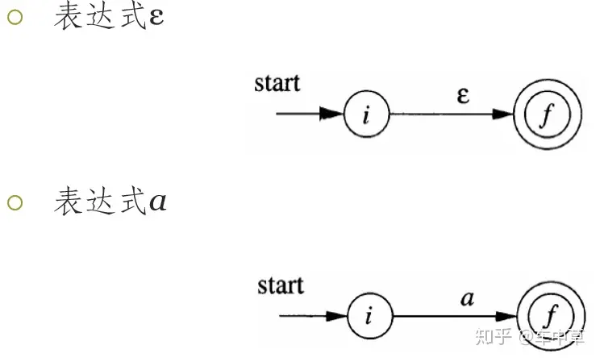
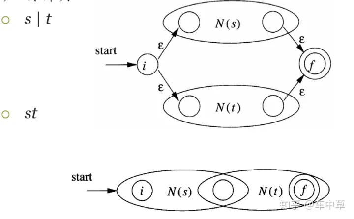
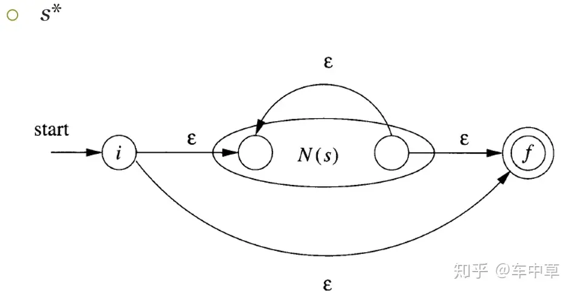
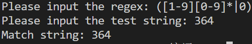
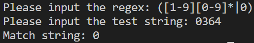
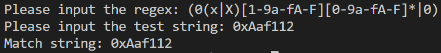
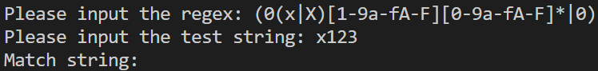

# Compile_OT1
Input a regex, get its NFA, DFA and minimized DFA. 

***

## 整体概述
实现了regex->nfa->dfa->min_dfa的转化，输入正则表达式和字符串，得到对应的词法分析结果。

核心类功能
- `Regex`：预处理正则表达式，实现regex->nfa->dfa->min_dfa的转化，并在min_dfa中匹配输入字符串
- `NFA_Node`：NFA图中的状态节点
- `NFA_Edge`：NFA图中的边
- `NFA`：NFA图
- `Regex2NFA`：Thompson算法将正则表达式转化为NFA图
- `DFA_Node`：DFA图中的状态节点
- `DFA_Edge`：DFA图中的边
- `NFA2DFA`：子集构造法将NFA转化为DFA
- `DFA2MinDFA`：Hopcroft算法将DFA转化为最小化DFA

***

## Regex To NFA

### NFA
- NFA_Edge中的ID对应的是边的ID，也可以理解为对应正则表达式的部分。例如正则表达式中`[1-9]`在NFA中是做为1条边而不是9条边，这个部分可以匹配哪些字符串保存在Regex的成员变量G中
- NFA_Edge中的char_ID存储的是边上字符，实际上并没有使用。他的唯一作用是在提取字符集的时候判断这条边是否为`ε`([# or @](#jump))，
- NFA_Node中的成员变量visited表示这个节点是否被访问过，在NFA转化为DFA的时候会用到
- NFA图维护起始节点和结束节点即可
```c
class NFA_Node;
/*NFA边*/
class NFA_Edge
{
	public:
		char char_ID; // 边上的字符
		int ID; // 边上的ID,表示的是使用正则串的哪一部分
		NFA_Node* des; // 指向的Node
		NFA_Edge(int ID,char char_ID,NFA_Node* des)
		{
		    this->ID=ID;
			this->char_ID=char_ID;
			this->des=des;
		}
};

/*NFA节点*/
class NFA_Node
{
	public:
		int stateID; // 节点ID
		vector<NFA_Edge*> t; // 节点的边
		bool visit; // 是否访问过，在NFA转化为DFA的时候会用到
		NFA_Node(int stateID)
		{
			visit=false;
			this->stateID=stateID;
		}
		void AddNFA_Edge(NFA_Edge* tt) // 添加边
		{
			t.push_back(tt);
		}

};

/*NFA图*/
class NFA
{
	public:
		NFA_Node* start; // 起始节点
		NFA_Node* end;// 结束节点
		NFA(){}
		NFA(int Start_ID,int ID,char c) // Start_ID: 起始节点ID, ID: 边的ID, c: 边的字符
		{
			NFA_Node* s1=new NFA_Node(Start_ID);
			NFA_Node* s2=new NFA_Node(Start_ID+1);
			NFA_Edge* tt=new NFA_Edge(ID,c,s2);
			s1->AddNFA_Edge(tt);
			start=s1;
			end=s2;
		}

};
```

### Regex2NFA
处理流程
1. 在regex中添加连接符(本程序中使用&表示连接)
2. regex转为后缀表达式
3. 从左到右读取得到的后缀表达式(类似于后缀表达式的计算)
	- 遇到表达式新建一个NFA图，两个节点一条边，边上是表达式的字符，将该图压入栈中

	

	- 遇到双目运算(&和|)弹出两个NFA图，按照图示规则进行运算，将新图压入栈中

	

	- 遇到单目运算(闭包运算)(?,*,+)弹出一个NFA图，按照图示规则进行运算，将新图压入栈中

	


<span id="jump">

**注意**：添加`ε`边时，闭包运算中控制循环的`ε`边(图中红框内的)和其他的`ε`边是不同的，前者是为了控制循环，后者是为了连接两个NFA图。如果不加以区分，在之后读取字符集的时候会陷入死循环。所以使用`@`表示正常的`ε`边，使用`#`表示闭包中控制循环的`ε`边。
</span>

(添加&和改为后缀表达式的代码在这里不详细说了，源码中的注释十分详细)

**核心算法**：
处理`&`、`|`、`*`、`?`、`+`的函数，依照的就是上面图中展示的算法。代码很清晰，所以不过多写注释了。

```c++
// 处理 &
// 把G1接到G2后面
NFA& Connect(NFA G1, NFA G2)
{
    NFA_Edge* t=new NFA_Edge(-1,'@',G1.start); 
    G2.end->AddNFA_Edge(t)	;
    G2.end = G1.end;
    return G2;
}
// 处理 |
NFA& Union(NFA G1, NFA G2)
{
    NFA_Node* n1=new NFA_Node(State_ID++); 
    NFA_Edge* t1=new NFA_Edge(-1,'@',G1.start);
    NFA_Edge* t2=new NFA_Edge(-1,'@',G2.start);
    n1->AddNFA_Edge(t1);
    n1->AddNFA_Edge(t2);

    NFA_Node* n2=new NFA_Node(State_ID++);
    NFA_Edge* t3=new NFA_Edge(-1,'@',n2);
    NFA_Edge* t4=new NFA_Edge(-1,'@',n2);
    G1.end->AddNFA_Edge(t3);
    G2.end->AddNFA_Edge(t4);

    NFA* G=new NFA(); // 一个或要添加一个新的NFA
    G->start=n1;
    G->end=n2;

    return *G;
}
// 处理 * 
NFA& Closure(NFA G2,char temp)
{
    NFA_Edge* t=new NFA_Edge(-1,'#',G2.start);
    G2.end->AddNFA_Edge(t);

    NFA_Node* n1=new NFA_Node(State_ID++);
    NFA_Edge* t1=new NFA_Edge(-1,'@',n1);
    G2.end->AddNFA_Edge(t1);

    NFA_Node* n2=new NFA_Node(State_ID++);
    NFA_Edge* t2=new NFA_Edge(-1,'@',G2.start);
    n2->AddNFA_Edge(t2);


    NFA_Edge* t3=new NFA_Edge(-1,'@',n1);
    n2->AddNFA_Edge(t3);

    NFA* G=new NFA();
    G->start=n2;
    G->end=n1;

    return *G;
}
// 处理 ? 
NFA& que_Closure(NFA G2)
{

    NFA_Node* n1=new NFA_Node(State_ID++);
    NFA_Edge* t1=new NFA_Edge(-1,'@',n1);
    G2.end->AddNFA_Edge(t1);

    NFA_Node* n2=new NFA_Node(State_ID++);
    NFA_Edge* t2=new NFA_Edge(-1,'@',G2.start);
    n2->AddNFA_Edge(t2);


    NFA_Edge* t3=new NFA_Edge(-1,'@',n1);
    n2->AddNFA_Edge(t3);

    NFA* G=new NFA();
    G->start=n2;
    G->end=n1;

    return *G;
}
// 处理 + 
NFA& add_Closure(NFA G2,char temp)
{
    // NFA_Edge* t=new NFA_Edge(T[temp][C[temp]],'#',G2.start);
    NFA_Edge* t=new NFA_Edge(-1,'#',G2.start);
    G2.end->AddNFA_Edge(t);

    NFA_Node* n1=new NFA_Node(State_ID++);
    NFA_Edge* t1=new NFA_Edge(-1,'@',n1);
    G2.end->AddNFA_Edge(t1);

    NFA_Node* n2=new NFA_Node(State_ID++);
    NFA_Edge* t2=new NFA_Edge(-1,'@',G2.start);
    n2->AddNFA_Edge(t2);

    NFA* G=new NFA();
    G->start=n2;
    G->end=n1;

    return *G;
}
```

转换函数

```c++
NFA ToNFA()
{

    NFA tempb,tempb1,tempb2;

    char cur_char;
    int i=0;

    while (i<lamb.size())
    {
        cur_char = lamb[i];
        if (isOperator(cur_char))
        {
            switch (cur_char)
            {
                case '|':
                    tempb1 = NFA_Stack.top();
                    NFA_Stack.pop();
                    tempb2 = NFA_Stack.top();
                    NFA_Stack.pop();
                    tempb1=Union(tempb2,tempb1);
                    NFA_Stack.push(tempb1);
                    break;
                case '&':
                    tempb1 = NFA_Stack.top();
                    NFA_Stack.pop();
                    tempb2 = NFA_Stack.top();
                    NFA_Stack.pop();
                    tempb2=Connect(tempb1,tempb2);
                    NFA_Stack.push(tempb2);
                    break;
                case '*':
                    tempb1 = NFA_Stack.top();
                    NFA_Stack.pop();
                    tempb1=Closure(tempb1,cur_char);
                    NFA_Stack.push(tempb1);
                    break;
                case '?':
                    tempb1 = NFA_Stack.top();
                    NFA_Stack.pop();
                    tempb1=que_Closure(tempb1);
                    NFA_Stack.push(tempb1);
                    break;
                case '+':
                    tempb1 = NFA_Stack.top();
                    NFA_Stack.pop();
                    tempb1=add_Closure(tempb1,cur_char);
                    NFA_Stack.push(tempb1);
                    break;
            }
        }
        else
        {
            tempb = NFA(State_ID,char_set[cur_char][C[cur_char]++],cur_char); // 给这个新字符创造一个新的NFA,这个NFA的长相是,State_ID作为起始节点, 只有一条边,ID是中间那个参数,边上的字符是最后那个参数
            State_ID+=2; // 由于tempb中新增的是两个nfa节点
            NFA_Stack.push(tempb); // 把这个新的nfa状态push进去,当之后读到运算符会再弹出进行处理
        }
        i++;
    }
    tempb = NFA_Stack.top();
    NFA_Stack.pop();
    return tempb;
}
```

添加表达式的关键代码
```c++
tempb = NFA(State_ID,char_set[cur_char][C[cur_char]++],cur_char); 
State_ID+=2; // 由于tempb中新增的是两个nfa节点
NFA_Stack.push(tempb); // 把这个新的nfa状态push进去,当之后读到运算符会再弹出进行处理
```

`char_set[cur_char][C[cur_char]++]`中, 
- `char_set[cur_char][C[cur_char]++]`是现在读取到的字符c是处理后正则串的第多少个部分(将这个序号作为边的ID，可以保证每条有意义的边(不是`ε`边)的ID都不同)
- `[cur_char]`是字符cur_char
- `[C[cur_char]++]`是现在读取到的这个字符c是相同字符的第C[cur_char]出现
- `C[cur_char]`是字符cur_char的数量,从0开始,每次又遇到这个字符的边就++

***

## NFA To DFA

### DFA
DFA的结构和NFA的结构类似：
- DFA_Edge中char_ID和NFA_Edge的ID作用相同，用于保存这条边对应的正则表达式的部分
- DFA_Node中`inc`保存这个DFA状态对应的NFA状态集合
- DFA没有专门构造图类，因为在后续使用中只需要知道知道这个Node是不是结束态以及起始节点即可，不需要像NFA一样需要知道起始和结束节点对图进行扩展

```c++
class DFA_Edge;

/*DFA节点*/
class DFA_Node
{
	public:
		int stateID; // DFA节点ID
		vector<DFA_Edge*> t; // 节点边
		vector<int> inc; // 这个dfa状态包含了哪些nfa节点
		bool flag; // 表示这个状态是不是结束态,为true就是结束状态
		DFA_Node(int s)
		{
			flag=false;
			stateID=s;
		}

		DFA_Node()
		{

		}
};

/*DFA边*/
class DFA_Edge
{
	public:
		int char_ID;// 边ID，对应正则表达式的部分
		DFA_Node* des;
		bool visit;
		DFA_Edge(int a,DFA_Node* &b)
		{
			char_ID=a;
			des=b;
			visit=false;
		}
};
```

### get_CharSet
遍历所有的nfa节点。从start开始，加入队尾，从队首弹出节点。遍历每个节点的所有边，遇到非空边就加入字符集中(set维护，避免重复)。遇到`#`边就跳过，其余的边将des_node加入队列中，重复操作直到队列为空。
```c++
// 参数列表: nfa图, 字符集保存的是ID!!
void getCharSet(NFA &G,set<int> &S,vector<NFA_Node*> &V)
{
	queue<NFA_Node*> char_queue;
	char_queue.push(G.start);
	char temp_char;
	while(!char_queue.empty())
	{
		NFA_Node* tmp=char_queue.front();
		char_queue.pop();
		V.push_back(tmp);
		tmp->visit=true;

		if(tmp->t.size()>0)
		for(int i =0;i<tmp->t.size();i++)
		{
			temp_char=tmp->t[i]->char_ID;
			if(temp_char!='@' && temp_char!='#')
            {
                //cout<<tmp->t[i]->ID<<" "<<endl;
                S.insert(tmp->t[i]->ID);
            }

			if(temp_char=='#') {} // # 对应闭包的空边,push进来会陷入死循环
            else
            {
                if(tmp->t[i]->des->visit==false)
                {
                    char_queue.push(tmp->t[i]->des);
                    tmp->t[i]->des->visit=true;
                }
            }
		}
	}
}
```
### NFA2DFA

使用的核心变量
- `int MaxStatus` dfa图最多有多少状态(实际上就是nfa图中的状态数)
- `int visit[MAX]` 标记某个nfa状态是否被访问过，在计算闭包的时候需要判断这个状态是否被访问过，未被访问过再添加。每次计算完一个nfa状态集的状态转换后都要清零
- `vector<NFA_Node*> tmp` 临时保存状态转换后到达的nfa状态，每次计算完一次状态转换后都要清零
- `set<int> CharSet` 字符集
- `vector<NFA_Node*> nfa` nfa图
- `NFA_Node* start` nfa图的起始节点
- `vector<DFA_Node*> dfa` dfa图
- `int nfa_end` nfa图中结束状态的ID，可以用来判断一个dfa节点是不是结束状态
- `int T[MAX][MAX]` T[i][j]表示第i个DFA状态中有哪些NFA状态(可以理解为第i个nfa状态集中有哪些状态) , T[i][0]存储的是第i个状态集中有多少个状态, T[0][0]存储的是一共有多少个DFA状态(或者说是有多少个nfa状态集)

子集构造法的实现
1. 计算起始节点的闭包，将起始节点作为第一个状态集添加到dfa状态(T[1])中
2. 遍历所有dfa状态(会动态增加)
3. 对每一个dfa状态(T[i])，遍历字符集，遍历其中每个nfa状态(T[i][j])，得到这个状态集吃入某个字符最后到达的状态集合(tmp)
4. 计算这个状态集(tmp)的ε闭包(visit)
5. 查看这个闭包(visit)是否是曾经出现过的某个状态集，如果是，就添加一条边；如果不是，就添加一个新的状态集以及一条边

核心代码
```c++
void find_closure(NFA_Node* p) // 寻找从p出发的ε闭包
{
    visit[p->stateID]=1;
    visit[0]++;
    if(p->t.size()==0) return;
    for(int i=0;i<p->t.size();i++)
    {
        if(!visit[p->t[i]->des->stateID]&&(p->t[i]->char_ID=='#'||p->t[i]->char_ID=='@'))
        find_closure(p->t[i]->des);
    }
}

void closure()
{
    for(int i=0;i<tmp.size();i++)
    {
        find_closure(tmp[i]);
    }
}

// 运行find_closure()之后的状态就是, visit[0]记录这次闭包访问了多少个状态, visit[i]记录了状态i是否被访问过

int AddDFAStatus() // 添加DFA状态
{
    if(visit[0]==0) // 如果访问过状态为0的则返回-2
        return -2;
    //接下来找这个状态集是不是已经出现过了
    for(int i=1;i<=T[0][0];i++)  // T[i][j]表示第i个DFA状态中有哪些NFA状态(可以理解为第i个状态集中有哪些状态) , T[i][0]存储的是第i个状态集中有多少个状态, T[0][0]存储的是一共有多少个DFA状态(或者说是有多少个状态集)
    {   
        // visit[i]表示第i个NFA状态在不在这个状态集中,visit[0]存储了这个状态集中有多少个状态
        if(visit[0]!=T[i][0]) // 首先如果数量都不想等,一定不是我们要找的状态集
            continue;
        
        // 如果数量相等了,接下来检查状态集中状态是不是完全一样
        int j=1;
        for(;j<=MaxStatus;j++) // 遍历所有状态
            if(visit[j]!=T[i][j]) // 如果存在某个状态不一样,就说明不是相同的状态集
                break;

        // 如果上面这个j走到了最后,就说明这两个状态集完全一样,那就不创建新的状态集(也就是DFA节点)了,返回对应的状态集就行了
        if(j==(MaxStatus+1))// 如果visit和T[i]是同一组，则返回i
            return i;
    }
    // 如果上面的循环走完了,说明这个状态集是一个新的状态集,需要创建一个新的DFA节点
    T[0][0]++; // T[0][0]记录DFA状态的数量(也就是状态集的数量)
    for(int i=0;i<=MaxStatus;i++)
        T[T[0][0]][i]=visit[i]; // 复制这个新的状态集
    return -1;

}

void moveto(int st,int c)
{

    for(int i=1;i<=MaxStatus;i++) // 遍历状态集中的每一个状态,看看他吃入字符c后能到达哪个状态
    {
        if(T[st][i]) // T[st][i]表示状态集st中的状态i(为1说明这个状态集中有这个状态)
        {
            NFA_Node* p=find_nfa(i);
            if(p->t.size()>0)
            for(int j=0;j<p->t.size();j++)
            if(p->t[j]->ID==c)
            {tmp.push_back(p->t[j]->des);} // 把到达的状态加入到tmp中
        }
    }
}
/*转换算法*/
void ToDFA()
{
    int i,j;

    // 遍历起始的start
    find_closure(start);
    AddDFAStatus();

    DFA_Node* s1=new DFA_Node(1);
    if(visit[nfa_end]) s1->flag=true; // 如果这个dfa状态包含nfa的结束态,则这个dfa状态也是结束态

    // 把这个DFA节点对应的NFA节点记录下来
    for(i=1;i<=MaxStatus;i++)
    if(visit[i]) s1->inc.push_back(i); 

    // 添加这个dfa节点
    dfa.push_back(s1);
    Init();

    // 遍历所有状态集,看他们通过状态转换都能到达哪里
    for(i=1;i<=T[0][0];i++)
    {
        // 遍历字符表,看这个状态集吃入字符后能到达哪里
        for(set<int>::iterator t1=CharSet.begin();t1!=CharSet.end();t1++)
        {
            moveto(i,*t1); // moveto之后吃掉这个字符能达到的状态都已经装进tem中了
            closure(); // 接着算tem的闭包
            if((j=AddDFAStatus())>=0) // 如果j>=0,说明这个状态集(或者叫dfa节点)吃掉这个字符转向了一个已经存在的状态(或者叫dfa节点)
            {
                // 那么就添加一条边就好了
                DFA_Edge* e1=new DFA_Edge(*t1,find_dfa(j)); // 新建一条边
                find_dfa(i)->t.push_back(e1); // 把这条边添加给状态集i

            }
            else if(j==-1) // 如果j==-1,说明有新增的状态集(或者叫dfa节点)
            {
                DFA_Node* d1=new DFA_Node(T[0][0]); // 创建一个新的dfa节点,这个节点的id就是这个状态集的id
                if(visit[nfa_end]) 
                {
                    d1->flag=true; // 如果这个状态集里有nfa的终态,则这个dfa也设置为终态
                }
                for(int tt=1;tt<=MaxStatus;tt++) // 遍历状态集
                {
                    if(visit[tt]) 
                        d1->inc.push_back(tt);// 把这个状态集中存在的状态保存到dfa节点对应的成员中
                }
                dfa.push_back(d1); // 把新增的dfa节点添加进dfa图中
                DFA_Edge* e1=new DFA_Edge(*t1,find_dfa(T[0][0])); // 添加一条指向新增dfa节点的边
                find_dfa(i)->t.push_back(e1); // 这个边给状态i(或者叫dfa节点i)
            }

            Init(); // 每一次检测结束之后,都要把visited和tem清空
        }
    }
    resetID(); // 重置dfa节点的id
}
```

***

## DFA To MinDFA

核心变量

- `NFA2DFA * ntd;` 主要使用已经转化好的dfa和字符集
- `vector<DFA_Node*> min_dfa;` 最小化的dfa图
- `int v;` 原dfa中有多少状态
- `int t = 2;` min_dfa中有多少状态，起始是2
- `int p[MAX];` 记录某个dfa状态属于哪个状态集
- `vector<int> Status;` 保存状态集, Status[i]表示状态集i中有哪些状态

Hopcroft算法流程：
1. 首先将所有集合分入终态、非终态两个状态集中
2. 进入一个while(1)循环
3. 遍历字符集，比如某次拿到了字符c
4. 遍历状态集，使用字符c去分割该状态集，比如尝试分割状态集i
5. split(i,c)表示使用字符c尝试分割状态集i。遍历状态集i中所有状态，查看这些状态吃入字符c到达哪个状态。比如某个状态吃入字符c转向了状态v，p[v]保存着状态v所属的状态集，b[p[v]]保存了有哪些状态转向状态集p[v]，a[p[v]]保存了状态集p[v]中有哪些状态被转向
6. 遍历所有状态集，比如某次遍历到状态集i，加入a[i]不为0，说明有状态转向了状态集i，此时把转向状态集i的状态分割出来，分割出来的状态作为一个新的状态集

核心代码
```c++
// 注意处理空集!!!
void split(int x, int c)
{
    int s = Status[x]; // s是要分割的状态集中的状态,可以理解为第一位为1则状态1在集合中,为0则状态1不在集合中
    int a[MAX];//吃完字符达到的状态集 
    int b[MAX];//对应a中分割的吃字符前的状态 
    memset(a,0,sizeof(a));
    memset(b,0,sizeof(b));
    int i,j,k;
    for(i = 0;i < v;i++){
        if((s>>i)&1){//遍历集合中的状态
            bool find = false;
            for(j = 0;j < ntd->dfa[i]->t.size();j++){
                if(ntd->dfa[i]->t[j]->char_ID == c){ // 如果从状态i吃入字符c
                    int v = ntd->dfa[i]->t[j]->des->stateID; // v是状态i吃入字符c后到达的状态
                    // p[v]是状态v所属的状态集
                    a[p[v]] |= (1<<v);// (可以表示状态i吃完字符达到状态v,且能达到这个状态集是因为状态v)
                    b[p[v]] |= (1<<i);// (可以表示状态i吃完字符达到状态v,且能达到这个状态集是因为状态i)
                    // 上面这两个可以得知,到达某一个状态集p[v],是由哪些状态(存储在b[p[v]]中)到达哪些状态(存储在a[p[v]]中)进入这个状态集(p[v])的
                    find = true;
                }
            }
            if(!find)
            {
                b[MAX-1] |= (1<<i);
            }
        } 
    }
    int ll = t; // 当前有多少状态集
    for(i = 0;i < ll;i++){ // 遍历所有状态集
        if(b[i]==Status[x]) break; // b[i]是到达状态集i有哪些状态,如果b[i]和要分割的状态集相同,说明这些状态都转向了同一个状态集,没有发生区分,所以退出
        if(a[i] && i!=x){ // 如果a[i]不为空,说明有状态转向了状态集i,且i不是要分割的状态集
            Status.push_back(b[i]); // b[i]这个状态集分割出来作为一个新的状态集,因为这些状态导向了状态集i
            // 修改被分割的状态所属的状态集
            for(k = 0;k < v;k++) // 遍历所有状态
                if((b[i]>>k)&1) // 如果这个状态在b[i]中,则分割出他们
                p[k] = t; // 这个状态所属的状态集在t处
            Status[x]&=(~b[i]); // 原来的状态集要把已经分割出去的状态清除
            t++;
        }
    }
    // 处理空集
    if(b[MAX-1]!=0 && b[MAX-1]!=Status[x])
    {
        Status.push_back(b[MAX-1]); // b[MAX-1]这个状态集分割出来作为一个新的状态集,因为这些状态导向了空状态
            // 修改被分割的状态所属的状态集
            for(k = 0;k < v;k++) // 遍历所有状态
                if((b[MAX-1]>>k)&1) // 如果这个状态在b[i]中,则分割出他们
                p[k] = t; // 这个状态所属的状态集在t处
            Status[x]&=(~b[MAX-1]); // 原来的状态集要把已经分割出去的状态清除
            t++;
    }
}

void Hopcroft()
{
    int N = 0,A = 0;
    for(int i = 0;i < v;i++){//分成N和A两个集合 
        if(!ntd->dfa[i]->flag){// 如果flag是0,说明这个状态不是一个结束态,则把他分割进A中
            A |= (1<<ntd->dfa[i]->stateID);
            p[ntd->dfa[i]->stateID] = 0; // 同时先把这个状态归入状态集0中
        }
        else{
            N |= (1 << ntd->dfa[i]->stateID); // 否则把他分割进N中
            p[ntd->dfa[i]->stateID] = 1;// 把这个状态归入状态集1中
        }
    }
    if(N == 0) return ; // 如果N为空,说明没有结束态,则不需要分割(根本割不了)
    Status.push_back(A);
    Status.push_back(N); // 装入状态集的vector中

    cout<<N<<" "<<A<<endl;

    int i,j;
    int l; // l保存的是每一个分割前有多少状态集
    while(1){
        for(set<int>::iterator t1=ntd->CharSet.begin(); t1!=ntd->CharSet.end();t1++){ // 遍历字符集
            l = t;
            for(j = 0;j < l;j++)
                split(j,*t1); 
        }
        if(l==t) break;//集合大小不变算法结束 
    }
}

int move_to(int x, int c)
{
    int s = Status[x]; // s是要分割的状态集中的状态,可以理解为第一位为1则状态1在集合中,为0则状态1不在集合中
    int a[MAX];//吃完字符达到的状态集 
    int b[MAX];//对应a中分割的吃字符前的状态 
    memset(a,0,sizeof(a));
    memset(b,0,sizeof(b));
    int i,j,k;
    for(i = 0;i < v;i++){
        if((s>>i)&1){//遍历集合中的状态
            for(j = 0;j < ntd->dfa[i]->t.size();j++){
                if(ntd->dfa[i]->t[j]->char_ID == c){ // 如果从状态i吃入字符c
                    int v = ntd->dfa[i]->t[j]->des->stateID; // v是状态i吃入字符c后到达的状态
                    return p[v];
                }
            }
        } 
    }
    return -1;
}
```

***

## Regex

Regex主要负责一些正则表达式的特殊匹配规则(如[1-9], \^[1-9], \d, \b, \w, \t等)，实现了一个match函数(图搜索主要使用dfs)，将输入的表达式与生成的min_dfa进行匹配，模拟词法分析过程

主要实现功能
- 预处理正则表达式，识别正则表达式中的一些特殊匹配规则，将这些部分在正则串中替换为字符a(实际上替换成什么不重要，之后我们只会用他的位置ID)。这些特殊匹配规则能匹配哪些字符保存在`vector<char> G[MAX];// G[i]存储的是第i部分可以匹配哪些字符`
- 初始化三个转换器(Regex2NFA, NFA2DFA, DFA2MinDFA)，并将预处理的正则表达式输入得到最终的MinDFA
- 实现了一个dfs函数，可以在MinDFA图中对输入的字符串进行匹配

匹配代码
```c++
// s是要匹配的字符串,result是匹配的结果
void match(string s,string *result) // 匹配字符串
{
    accept=false;
    str=s;

    for (int i=0;i<s.length();i++)
    {
        word_start=check_word_start(i);
        line_start=check_text_start(i);
        if (deal_line && text_start && !line_start) continue;
        if (deal_word && word_start && word_not_match) continue;

        dfs(dtmin->min_dfa[0],i,i);
        if (accept) break;
    }

    int Max = 0;
    if (!accept) {return;}

    // 计算匹配到的字符串的长度
    for (int i = 0; i<ans.size(); i++)
    {
        if (ans[i].second - ans[i].first + 1 > Max) 
            Max = ans[i].second - ans[i].first + 1;
    }
    // 将匹配到的字符串从 str 中提取出来，存储在 result 指针所指向的字符串中
    *result=str.substr(ans[0].first, Max);
}

void dfs(DFA_Node* p, int k, int st)
{
    // 如果当前节点是结束状态，检查是否满足匹配条件
    if (p->flag)
    {
        bool can_go=true;
        // 如果需要匹配单词，检查单词的起始和结束位置是否正确
        if (word_match)
        {
            word_end=check_word_end(k-1);
            if (!word_start && !word_end) can_go=false;
        }
        // 如果需要匹配不包含单词的字符串，检查单词的起始和结束位置是否正确
        if (word_not_match)
        {
            word_end=check_word_end(k-1);
            if (word_start || word_end) can_go=false;
        }
        // 如果需要匹配行尾，检查当前字符是否为行尾
        if (text_end)
        {
            line_end=check_text_end(k-1);
            if (!line_end) can_go=false;
        }
        // 如果满足匹配条件，将匹配结果加入答案
        if (can_go)
        {
            ans.push_back(make_pair(st, k-1));
            accept=true;
        }
    }
    // 如果已经匹配到字符串末尾，返回
    if (k==str.length()) return;
    // 遍历当前节点的所有出边
    for (int i=0;i<p->t.size();i++)
    {
        int u=p->t[i]->char_ID;
        DFA_Node* f=p->t[i]->des;
        // 如果当前字符可以转移，继续搜索
        if (F[u])
        for (int j=0;j<G[u].size();j++)
        {
            char c=G[u][j];
            if (str[k]!=c) continue;
            k++;
            dfs(f,k,st);
            k--;
        }
        // 如果当前字符不能转移，跳过当前出边
        else
        {
            bool flag=false;
            for (int j=0;j<G[u].size();j++)
            {
                char c=G[u][j];
                if (str[k]==c) flag=true;
                if (flag) break;
            }
            if (flag) continue;
            k++;
            dfs(f,k,st);
            k--;
        }
    }
}
```

***

## 测试

### 十进制数

**正常匹配**



**起始为0，只能匹配到`|0`的0**



### 十六进制数

**正常匹配**



**没有0起始，什么也匹配不到**



## 总结

该程序仍有很多不足，首先对正则表达式语法的支持还不够完善(如限定符、反向引用、正向预查等语法)，只能处理一些简单的正则表达式；代码实现较为混乱(尤其是命名)；没有考虑正则表达式字符过多的问题；算法实现时各种数组或者向量操作开销也较大
